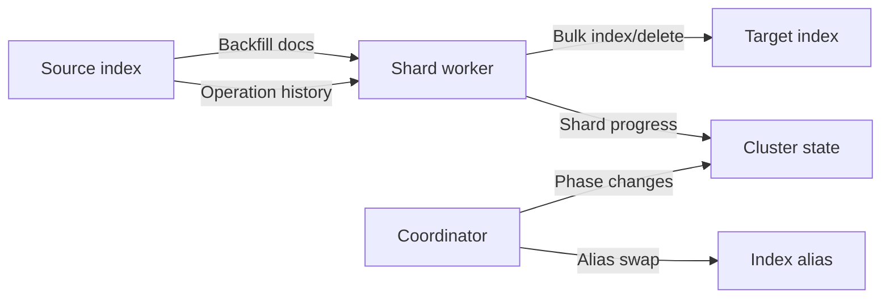

# Architecture Overview

AOSC separates migration orchestration from shard-local data movement.

## Architecture Diagram

## Components

| Component | Role |
|-----------|------|
| Coordinator | Runs on the cluster-manager node. Owns coordinator phase transitions and cutover. |
| Shard worker | Runs on a data node that holds a source primary shard. Performs backfill and replay for that shard. |
| Backfill permit manager | Limits how many shard workers per node may do heavy backfill work at once. |
| Bulk writer | Sends transformed index/delete operations to the target. |
| `.aosc-migrations` | Stores migration documents and detailed progress snapshots. |
| Cluster state | Carries active coordinator and shard phase state. |

## Data Flow

Backfill reads source documents, applies the configured transform, and indexes target documents with the same ID and routing when routing is present.

Replay reads source operation history through OpenSearch shard APIs. Index/create operations are transformed and indexed into the target. Delete operations are applied to the target according to the detected routing mode.

## Start Preconditions

Before accepting a migration, AOSC validates that:

- Source and target indices exist.
- Source and target index names are different.
- The alias is valid for cutover.
- The plugin is installed consistently on all nodes.
- The target routing mode can be handled, or explicit consent has been provided for risky routing cases.
- The transform and validation query are valid enough to start.

AOSC does not create the target index.

## Migration Lifecycle

1. `INITIALIZING`: create the migration record and prepare workers.
2. `ACTIVE`: workers backfill and replay until converged.
3. `PREPARING_TARGET`: restore target settings and wait for readiness.
4. `CUTTING_OVER`: apply source write block and flush source.
5. `CATCHING_UP`: workers replay final operations.
6. `COMPLETING`: validate, swap alias, remove source write block if configured, and clean up.
7. Terminal phase: `COMPLETED`, `CANCELLED`, or `FAILED`.

## Failure Model

AOSC prefers failing closed over serving a partial cutover. Before alias swap, failure should leave the alias on the source. If alias swap has already completed, AOSC does not roll the alias back automatically because writes may already be landing on the target.

Cancellation and failure cleanup release leases and remove the source write block where possible. Target index deletion is manual.

## Transform Boundary

The base plugin supports the OpenSearch `update` script context. Scripts mutate `ctx._source`; omit `transform_script` for identity behavior.

Built-in transforms are one-source-document to one-target-document. Fan-out, joins, external lookups, and cross-cluster movement are outside the base plugin contract.

## Backpressure Boundary

AOSC limits migration pressure with per-node backfill permits, fixed or adaptive batch sizing, optional adaptive backfill concurrency, and overload backoff after repeated write failures. See [Backpressure and Throttling](backpressure-and-throttling.md).

Do not treat AOSC as zero-interruption or universally safe. It has a source write block during cutover, same-cluster scope, and routing constraints that must be reviewed before changing shard counts.

## Data Model

| Class | Purpose |
|-------|---------|
| `MigrationRequest` | User-submitted start request. |
| `MigrationRequestOptions` | Per-migration overrides. |
| `MigrationDocument` | Detailed migration document persisted in `.aosc-migrations`. |
| `MigrationSummary` | Slim list API projection. |
| `ShardProgressDocument` | Per-shard phase and per-phase counters. |
| `CoordinatorPhase` | Migration-level state enum. |
| `ShardPhase` | Worker-level state enum. |
