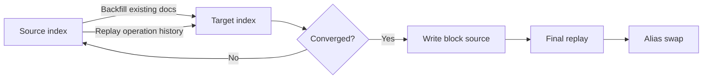

# What Is AOSC?

AOSC is an OpenSearch plugin for online index migration. It is designed for cases where the target index needs a different schema, shard layout, or document shape than the source index.

AOSC does not modify an index in place. You create a new target index, then AOSC copies and replays source data into it before swapping an alias.

## Problem

OpenSearch supports some mapping additions, but many schema and layout changes require a new index. A plain `_reindex` copies a point-in-time view of the source. If the source keeps receiving writes, you need a second process to replay or reconcile writes that happened during the copy.

AOSC provides that replay and cutover workflow inside the cluster.

## Migration Flow

## Vocabulary

| Term | Meaning |
|------|---------|
| Source index | The current index that holds live data. |
| Target index | The pre-created index with the desired mappings, settings, and shard count. |
| Alias | The application-facing name AOSC swaps from source to target at cutover. |
| Backfill | Copy of existing source documents into the target. |
| Replay | Applying source-shard operation history to the target. |
| Convergence | A shard is close enough to the source global checkpoint to proceed toward cutover. |
| Cutover | Write-block source, replay final operations, validate, and swap the alias. |
| Shard worker | Per-source-primary worker that performs backfill and replay. |
| Coordinator | Cluster-manager-side service that advances migration phases. |

## Required Assumptions

- The source and target are in the same OpenSearch cluster.
- The target index already exists.
- Applications use an alias that can be moved from source to target.
- Applications retry writes that are rejected during the cutover write block.
- The plugin is installed at the same version on all cluster nodes.

## Limitations to Understand First

- AOSC is not zero-interruption. Source writes are blocked briefly during cutover. Atlassian has observed successful production cutovers where the application-visible write interruption was about 2 seconds to 30 seconds, including a 50 TB index at about 30 seconds. This is an observation, not an upper bound; validation, alias update, cluster-manager responsiveness, shard count, and write load can make specific runs shorter or longer.
- AOSC does not delete the source or target index for you after a migration.
- Cross-cluster migrations are not supported.
- Custom routing and shard count changes require careful review; some routes require explicit data-loss consent.
- Built-in document transforms use OpenSearch update-script style and are currently 1:1 for each source document.

See [Known Limitations](../reference/known-limitations.md) before planning a real migration.
