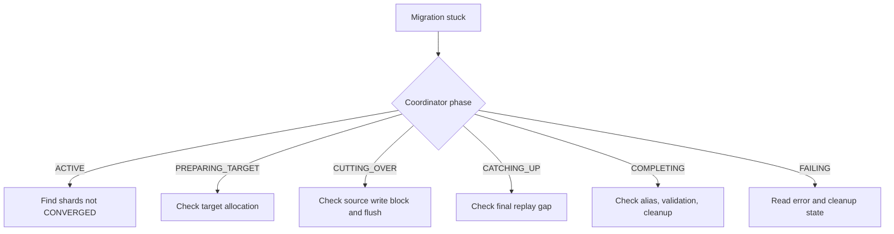

# Runbook: Stuck Migration

This runbook is for migrations that appear not to progress for longer than expected. Expected timing depends on index size, shard count, write rate, target health, and cluster load.

## First Checks

```bash
curl -s 'http://localhost:9200/_plugins/_aosc/my-index-v1/_status' | jq '{phase, error_message}'
curl -s 'http://localhost:9200/_cluster/health' | jq '.'
curl -s 'http://localhost:9200/_cat/shards?v'
curl -s 'http://localhost:9200/_cat/plugins?v'
```

Then inspect shard phases:

```bash
curl -s 'http://localhost:9200/_plugins/_aosc/my-index-v1/_status'   | jq '.shards | to_entries[] | {shard: .key, phase: .value.phase, error: .value.error}'
```

## Decision Tree



## Common Causes

| Symptom | Checks | Possible action |
|---------|--------|-----------------|
| Shards remain `PENDING` | `aosc.backfill.max_concurrent_per_node`, other active workers | Wait, increase permit limit, or set it back above `0`. |
| Stuck in `ACQUIRING_LEASE` | Source primary health, retention lease errors in data-node logs | Fix source shard health or retry after cluster stabilizes. |
| Stuck in `BACKFILLING` | Target indexing pressure, bulk rejections, heap, disk, batch size | Reduce backfill concurrency or batch size. |
| Stuck in `CONVERGING` | `current_gap`, `rounds`, source write rate, global checkpoint movement | Reduce write pressure, tune replay/backfill, or adjust convergence settings after review. |
| Stuck in `PREPARING_TARGET` | Target shard allocation and health | Fix target allocation, disk, or replica settings. |
| Stuck in `CATCHING_UP` | Source write block state, final replay errors | Check logs for replay failures and target write pressure. |
| Stuck in `COMPLETING` | Alias state, doc count validation, source write block policy | Inspect coordinator logs and alias state. On success, AOSC leaves the old source index write-blocked unless `remove_source_write_block_on_success` or `aosc.defaults.remove_source_write_block_on_success` is `true`. |
| Many AOSC retention leases remain after failure | `_nodes/stats` retention leases, active migrations | Use `_admin/_cleanup_leases` only after confirming no active migration needs them. |

## Tuning Examples

Slow new backfill work:

```bash
curl -X PUT 'http://localhost:9200/_cluster/settings' \
  -H 'Content-Type: application/json' \
  -d '{"transient":{"aosc.backfill.max_concurrent_per_node":2}}'
```

Reduce fixed backfill batch size:

```bash
curl -X PUT 'http://localhost:9200/_cluster/settings' \
  -H 'Content-Type: application/json' \
  -d '{"transient":{"aosc.backfill.controller.batch.size":1000}}'
```

Increase convergence rounds for future or active option resolution where applicable:

```bash
curl -X PUT 'http://localhost:9200/_cluster/settings' \
  -H 'Content-Type: application/json' \
  -d '{"transient":{"aosc.defaults.max_convergence_rounds":2000}}'
```

## Cleanup APIs

Preview lease cleanup:

```bash
curl -X POST 'http://localhost:9200/_plugins/_aosc/_admin/_cleanup_leases'
```

Remove AOSC-owned leases after confirming they are orphaned:

```bash
curl -X POST 'http://localhost:9200/_plugins/_aosc/_admin/_cleanup_leases?dry_run=false'
```

Preview cluster-state cleanup:

```bash
curl -X POST 'http://localhost:9200/_plugins/_aosc/_admin/_clear_state'
```

Clear cluster state only after normal cancellation/failure cleanup cannot resolve the state:

```bash
curl -X POST 'http://localhost:9200/_plugins/_aosc/_admin/_clear_state?dry_run=false'
```

## Escalate or Stop

Cancel or pause investigation before making destructive changes if:

- Multiple shards are failing with different errors.
- The source write block is present and the coordinator is not making progress.
- Alias state does not match the expected source or target.
- You cannot determine whether retention leases are still needed by an active migration.
