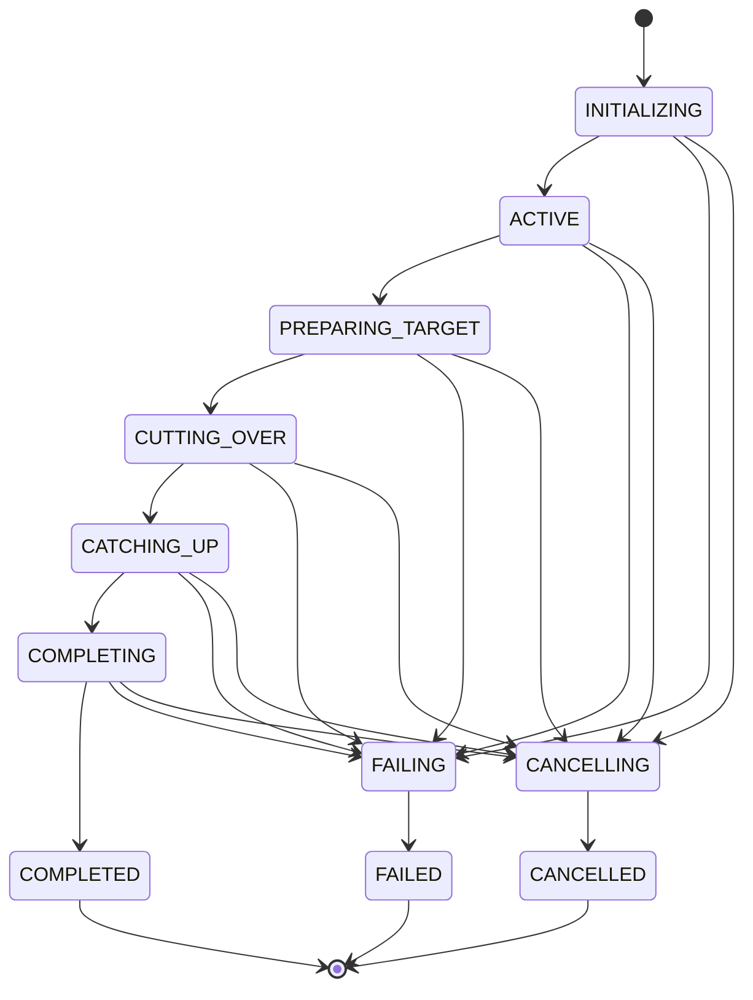
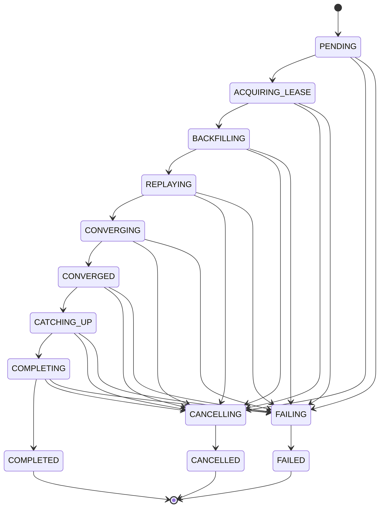

# State Machine Reference

AOSC tracks migration progress at two levels:

- `CoordinatorPhase`: migration-level orchestration on the cluster-manager node.
- `ShardPhase`: per-source-shard worker progress on data nodes.

Active state is coordinated through cluster state and in-memory coordinator caches. Detailed and terminal migration documents are stored in `.aosc-migrations`.

For the visual migration walkthrough, see [How AOSC Works](../how-it-works.md). That walkthrough is checked against the phase enums and transition tables in:

- `CoordinatorPhase` and `MigrationCoordinator`
- `ShardPhase` and `ShardMigrationWorker`
- the `_status` response shape documented in [REST API](rest-api.md)

This page is the phase reference. Cancellation and failure are interrupt paths from non-terminal states; see the diagrams below for those transitions.

## Coordinator Phases



| Phase | Terminal? | Meaning |
|-------|-----------|---------|
| `INITIALIZING` | No | Validate the request, capture metadata, create the migration document, and prepare worker state. |
| `ACTIVE` | No | Shard workers are backfilling, replaying, and converging. |
| `PREPARING_TARGET` | No | Restore target settings needed for cutover and wait for target readiness. |
| `CUTTING_OVER` | No | Apply source write block and flush source. |
| `CATCHING_UP` | No | Workers replay final source operations after the write block. |
| `COMPLETING` | No | Validate document counts, swap alias, remove source write block if configured, and clean up. |
| `COMPLETED` | Yes | Migration succeeded. |
| `CANCELLING` | No | Cancellation requested; workers and coordinator are cleaning up. |
| `CANCELLED` | Yes | Cancellation complete. |
| `FAILING` | No | Failure cleanup is running. |
| `FAILED` | Yes | Migration failed and reached terminal cleanup. |

## Shard Phases



| Phase | Terminal? | Meaning |
|-------|-----------|---------|
| `PENDING` | No | Waiting for a backfill permit. |
| `ACQUIRING_LEASE` | No | Acquiring a retention lease on the source shard. |
| `BACKFILLING` | No | Copying source documents into the target. |
| `REPLAYING` | No | Applying operation history from the source shard. |
| `CONVERGING` | No | Replaying additional rounds until the gap is below the threshold. |
| `CONVERGED` | No | Waiting for the coordinator to enter cutover. |
| `CATCHING_UP` | No | Replaying final operations after the source write block. |
| `COMPLETING` | No | Releasing leases and finalizing worker state. |
| `COMPLETED` | Yes | Shard finished successfully. |
| `CANCELLING` | No | Worker is stopping and cleaning up after cancellation. |
| `CANCELLED` | Yes | Worker cancellation complete. |
| `FAILING` | No | Worker failure cleanup is running. |
| `FAILED` | Yes | Worker failed. |

## Successful Path

```text
Coordinator:
INITIALIZING -> ACTIVE -> PREPARING_TARGET -> CUTTING_OVER -> CATCHING_UP -> COMPLETING -> COMPLETED

Shard:
PENDING -> ACQUIRING_LEASE -> BACKFILLING -> REPLAYING -> CONVERGING -> CONVERGED -> CATCHING_UP -> COMPLETING -> COMPLETED
```

## Storage and Status Reads

- Active migration status is served from the coordinator cache when available.
- Terminal and historical migration data is read from `.aosc-migrations`.
- `_list` returns a slim summary projection.
- `_status` returns the detailed migration document for one source index.

## Debugging Stuck Phases

| Stuck Phase | First Checks |
|-------------|--------------|
| `PENDING` | Backfill permit limit: `aosc.backfill.max_concurrent_per_node`. |
| `ACQUIRING_LEASE` | Source primary health and retention lease errors. |
| `BACKFILLING` | Target indexing pressure, bulk rejections, batch size, worker logs. |
| `CONVERGING` | Source write rate versus replay throughput and global checkpoint progress. |
| `PREPARING_TARGET` | Target shard allocation and target health. |
| `CATCHING_UP` | Source write block state, replay errors, and global checkpoint. |
| `COMPLETING` | Alias update errors, document count validation, source write block cleanup. |

See [Runbook: Stuck Migration](../operations/runbook-stuck-migration.md).
